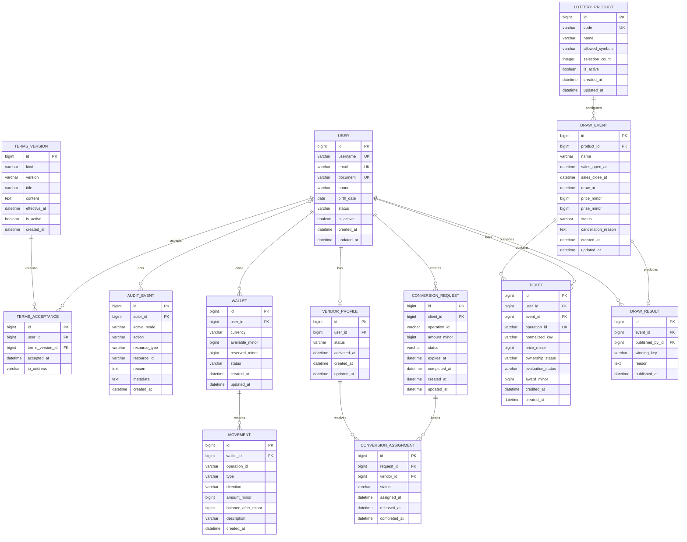

# Modelo entidad–relación — Taller #3 Lotería Binaria con Django

## 1. Diagnóstico breve

Este modelo corresponde exclusivamente al **Taller #3 de Lotería Binaria con Django**.

Decisiones aplicadas:

- primera fase con SQLite;
- segunda fase con MySQL;
- portabilidad entre ambos motores;
- cinco apps canónicas: `accounts`, `core`, `finance`, `vendors` y `lottery`;
- CRUD evaluable en `accounts`, `vendors` y `lottery`;
- montos enteros en minor units;
- reglas sensibles en servicios con `transaction.atomic`;
- historial protegido mediante `PROTECT`, estados o desactivación lógica;
- sin tipos, índices parciales ni constraints exclusivos de PostgreSQL;
- sin código Django ni migraciones en esta fase.

El modelo contiene las trece entidades solicitadas:

1. `User`
2. `TermsVersion`
3. `TermsAcceptance`
4. `AuditEvent`
5. `Wallet`
6. `Movement`
7. `VendorProfile`
8. `ConversionRequest`
9. `ConversionAssignment`
10. `LotteryProduct`
11. `DrawEvent`
12. `Ticket`
13. `DrawResult`

---

# 2. Distribución por aplicaciones

| App | Entidades | Responsabilidad |
|---|---|---|
| `accounts` | `User`, `TermsVersion`, `TermsAcceptance` | Identidad, autenticación, estado y términos |
| `core` | `AuditEvent` | Auditoría y utilidades transversales |
| `finance` | `Wallet`, `Movement` | Saldos y movimientos simulados |
| `vendors` | `VendorProfile`, `ConversionRequest`, `ConversionAssignment` | Perfil vendedor y solicitudes Cliente–Vendedor |
| `lottery` | `LotteryProduct`, `DrawEvent`, `Ticket`, `DrawResult` | Productos, eventos, boletos y resultados |

---

# 3. Diagrama ER en Mermaid



---

# 4. Entidades de `accounts`

## 4.1 `User`

Usuario personalizado que debe definirse antes de la primera migración general.

| Campo | Obligatorio | Unicidad | Descripción |
|---|---:|---:|---|
| `id` | Sí | PK | Identificador principal |
| `username` | Sí | Sí | Nombre de usuario |
| `email` | Sí | Sí | Correo normalizado |
| `document` | Sí | Sí | Documento personal |
| `phone` | No | No | Teléfono |
| `birth_date` | Sí | No | Fecha de nacimiento |
| `status` | Sí | No | Estado de la cuenta |
| `is_active` | Sí | No | Estado técnico de autenticación |
| `created_at` | Sí | No | Fecha de creación |
| `updated_at` | Sí | No | Última actualización |

Estados:

- `ACTIVE`
- `SUSPENDED`
- `BLOCKED`
- `DISABLED`

Cardinalidades:

- `User 1 ── 0..N TermsAcceptance`
- `User 1 ── 0..N Wallet`
- `User 1 ── 0..1 VendorProfile`
- `User 1 ── 0..N ConversionRequest`
- `User 1 ── 0..N Ticket`
- `User 1 ── 0..N DrawResult`
- `User 0..1 ── 0..N AuditEvent`

Reglas:

- `username`, `email` y `document` son únicos.
- La mayoría de edad se valida en formulario y servicio.
- La contraseña usa el hash de Django.
- Los roles se administran mediante Django Groups.
- El modo activo se guarda en la sesión del servidor.
- Solo una cuenta activa puede realizar operaciones.

Eliminación:

- sin historia: podría eliminarse de forma controlada;
- con historia: se desactiva mediante `status = DISABLED` e `is_active = False`;
- no se borran relaciones históricas.

---

## 4.2 `TermsVersion`

Versión de términos o política aceptable por los usuarios.

| Campo | Obligatorio | Unicidad | Descripción |
|---|---:|---:|---|
| `id` | Sí | PK | Identificador |
| `kind` | Sí | Compuesta | Tipo de documento |
| `version` | Sí | Compuesta | Número o código de versión |
| `title` | Sí | No | Título |
| `content` | Sí | No | Contenido |
| `effective_at` | Sí | No | Inicio de vigencia |
| `is_active` | Sí | No | Disponible para nuevas aceptaciones |
| `created_at` | Sí | No | Fecha de creación |

Unicidad:

```text
UNIQUE(kind, version)
```

Cardinalidad:

- `TermsVersion 1 ── 0..N TermsAcceptance`

Eliminación:

- una versión aceptada no se edita ni elimina;
- una nueva versión se crea como registro adicional;
- la versión anterior puede desactivarse.

---

## 4.3 `TermsAcceptance`

Registro histórico de aceptación de una versión de términos.

| Campo | Obligatorio | Unicidad | Descripción |
|---|---:|---:|---|
| `id` | Sí | PK | Identificador |
| `user_id` | Sí | Compuesta | FK a `User` |
| `terms_version_id` | Sí | Compuesta | FK a `TermsVersion` |
| `accepted_at` | Sí | No | Fecha y hora de aceptación |
| `ip_address` | No | No | IP guardada como texto portable |

Unicidad:

```text
UNIQUE(user_id, terms_version_id)
```

Cardinalidades:

- `User 1 ── 0..N TermsAcceptance`
- `TermsVersion 1 ── 0..N TermsAcceptance`

Claves foráneas:

- `user_id → User.id` con protección;
- `terms_version_id → TermsVersion.id` con protección.

Eliminación:

- nunca se borra mediante CRUD;
- es un registro histórico.

---

# 5. Entidad de `core`

## 5.1 `AuditEvent`

Registro append-only de acciones importantes.

| Campo | Obligatorio | Descripción |
|---|---:|---|
| `id` | Sí | PK |
| `actor_id` | No | FK al usuario que ejecutó la acción |
| `active_mode` | No | Modo activo al ejecutar |
| `action` | Sí | Acción realizada |
| `resource_type` | Sí | Tipo de recurso |
| `resource_id` | Sí | Identificador del recurso como texto |
| `reason` | No | Motivo |
| `metadata` | No | Metadatos no sensibles |
| `created_at` | Sí | Fecha y hora |

Cardinalidad:

- `User 0..1 ── 0..N AuditEvent`

Reglas:

- append-only;
- no se modifica ni elimina;
- no guarda contraseñas, tokens, CVV, secretos ni documentos completos;
- se indexa por actor, recurso y fecha.

Eliminación:

- nunca se borra;
- si el actor se desactiva, el registro se conserva.

---

# 6. Entidades de `finance`

## 6.1 `Wallet`

Wallet separada por usuario y moneda.

| Campo | Obligatorio | Unicidad | Descripción |
|---|---:|---:|---|
| `id` | Sí | PK | Identificador |
| `user_id` | Sí | Compuesta | FK a `User` |
| `currency` | Sí | Compuesta | `REAL` o `VIRTUAL` |
| `available_minor` | Sí | No | Saldo disponible |
| `reserved_minor` | Sí | No | Saldo reservado |
| `status` | Sí | No | Estado |
| `created_at` | Sí | No | Creación |
| `updated_at` | Sí | No | Actualización |

Estados:

- `ACTIVE`
- `BLOCKED`
- `CLOSED`

Monedas:

- `REAL`
- `VIRTUAL`

Unicidad:

```text
UNIQUE(user_id, currency)
```

Cardinalidades:

- `User 1 ── 0..N Wallet`
- `Wallet 1 ── 0..N Movement`

Reglas:

- `available_minor >= 0`;
- `reserved_minor >= 0`;
- REAL y VIRTUAL no se mezclan;
- los saldos no se editan mediante CRUD genérico;
- las operaciones se realizan en servicios transaccionales.

Eliminación:

- una wallet con movimientos no se borra;
- se bloquea o cierra.

---

## 6.2 `Movement`

Movimiento visible e histórico asociado a una wallet.

| Campo | Obligatorio | Descripción |
|---|---:|---|
| `id` | Sí | PK |
| `wallet_id` | Sí | FK a `Wallet` |
| `operation_id` | Sí | Identificador de correlación |
| `type` | Sí | Tipo de movimiento |
| `direction` | Sí | Crédito o débito |
| `amount_minor` | Sí | Monto entero positivo |
| `balance_after_minor` | Sí | Saldo posterior informativo |
| `description` | Sí | Descripción |
| `created_at` | Sí | Fecha |

Direcciones:

- `CREDIT`
- `DEBIT`

Tipos mínimos:

- `TOP_UP`
- `VIRTUAL_TO_REAL`
- `TRANSFER`
- `VENDOR_PURCHASE`
- `REQUEST`
- `TICKET_PURCHASE`
- `PRIZE`
- `REFUND`
- `ADJUSTMENT`

Cardinalidad:

- `Wallet 1 ── 0..N Movement`

Reglas:

- `amount_minor > 0`;
- `operation_id` debe estar indexado;
- el registro es append-only;
- `balance_after_minor` no concede autoridad para recalcular el saldo;
- una operación puede producir varios movimientos correlacionados.

Eliminación:

- nunca se borra ni edita;
- una corrección se registra con un movimiento compensatorio.

---

# 7. Entidades de `vendors`

## 7.1 `VendorProfile`

Perfil de vendedor asociado a una cuenta.

| Campo | Obligatorio | Unicidad | Descripción |
|---|---:|---:|---|
| `id` | Sí | PK | Identificador |
| `user_id` | Sí | Sí | Relación uno a uno con `User` |
| `status` | Sí | No | Estado del vendedor |
| `activated_at` | No | No | Fecha de activación |
| `created_at` | Sí | No | Creación |
| `updated_at` | Sí | No | Actualización |

Estados:

- `PENDING`
- `ACTIVE`
- `SUSPENDED`
- `DISABLED`

Cardinalidades:

- `User 1 ── 0..1 VendorProfile`
- `VendorProfile 1 ── 0..N ConversionAssignment`

Reglas:

- un usuario tiene como máximo un perfil vendedor;
- solo un perfil `ACTIVE` puede operar;
- el usuario debe conservar el rol VENDEDOR para usar el modo VENDEDOR.

Eliminación:

- sin historia: eliminación protegida opcional;
- con asignaciones o solicitudes relacionadas: desactivación lógica;
- no se borra historia.

---

## 7.2 `ConversionRequest`

Solicitud académica de conversión REAL a VIRTUAL.

| Campo | Obligatorio | Unicidad | Descripción |
|---|---:|---:|---|
| `id` | Sí | PK | Identificador |
| `client_id` | Sí | No | FK al cliente |
| `operation_id` | Sí | Sí | Identificador de operación |
| `amount_minor` | Sí | No | Monto solicitado |
| `status` | Sí | No | Estado |
| `expires_at` | Sí | No | Vencimiento |
| `completed_at` | No | No | Finalización |
| `created_at` | Sí | No | Creación |
| `updated_at` | Sí | No | Actualización |

Estados:

- `PENDING`
- `IN_PROGRESS`
- `COMPLETED_BY_VENDOR`
- `COMPLETED_BY_PLATFORM`
- `CANCELLED`
- `EXPIRED`
- `FAILED_LIQUIDITY`

Cardinalidades:

- `User 1 ── 0..N ConversionRequest`
- `ConversionRequest 1 ── 0..N ConversionAssignment`

Reglas:

- `amount_minor > 0`;
- al crear la solicitud, el REAL pasa de disponible a reservado;
- `expires_at` se fija al crear y no se extiende al asignar;
- los estados se modifican mediante servicios;
- no se usa un `UpdateView` genérico para transiciones;
- la operación debe ser atómica.

Eliminación:

- nunca se borra;
- cambia a estado terminal.

---

## 7.3 `ConversionAssignment`

Historial de asignaciones de solicitudes a vendedores.

| Campo | Obligatorio | Descripción |
|---|---:|---|
| `id` | Sí | PK |
| `request_id` | Sí | FK a `ConversionRequest` |
| `vendor_id` | Sí | FK a `VendorProfile` |
| `status` | Sí | Estado |
| `assigned_at` | Sí | Fecha de asignación |
| `released_at` | No | Fecha de liberación |
| `completed_at` | No | Fecha de finalización |

Estados:

- `ACTIVE`
- `RELEASED`
- `COMPLETED`
- `EXPIRED`

Cardinalidades:

- `ConversionRequest 1 ── 0..N ConversionAssignment`
- `VendorProfile 1 ── 0..N ConversionAssignment`

Reglas:

- una solicitud puede conservar varias asignaciones históricas;
- solo una asignación puede estar activa a la vez;
- para portabilidad no se usa `UniqueConstraint` condicional;
- la unicidad de asignación activa se controla en `services.py` con `transaction.atomic`;
- la concurrencia real se valida posteriormente en MySQL.

Eliminación:

- nunca se borra;
- se marca con un estado terminal.

---

# 8. Entidades de `lottery`

## 8.1 `LotteryProduct`

Producto oficial de lotería.

| Campo | Obligatorio | Unicidad | Descripción |
|---|---:|---:|---|
| `id` | Sí | PK | Identificador |
| `code` | Sí | Sí | Código estable |
| `name` | Sí | No | Nombre |
| `allowed_symbols` | Sí | No | Universo permitido |
| `selection_count` | Sí | No | Cantidad exacta |
| `is_active` | Sí | No | Estado lógico |
| `created_at` | Sí | No | Creación |
| `updated_at` | Sí | No | Actualización |

Productos válidos:

| Código | Símbolos | Cantidad exacta | Repetición |
|---|---|---:|---|
| `OCTAL` | `0-7` | 4 | No |
| `DECIMAL` | `0-9` | 5 | No |
| `HEXADECIMAL` | `0-9A-F` | 6 | No |

Cardinalidad:

- `LotteryProduct 1 ── 0..N DrawEvent`

Reglas:

- el código es único;
- los tres productos se crean de forma controlada;
- la combinación siempre se valida con la configuración del producto;
- no se permite el hexadecimal de cuatro símbolos del ZIP legado.

Eliminación:

- un producto con eventos no se elimina;
- se marca `is_active = False`.

---

## 8.2 `DrawEvent`

Evento de sorteo.

| Campo | Obligatorio | Descripción |
|---|---:|---|
| `id` | Sí | PK |
| `product_id` | Sí | FK a `LotteryProduct` |
| `name` | Sí | Nombre |
| `sales_open_at` | Sí | Apertura |
| `sales_close_at` | Sí | Cierre |
| `draw_at` | Sí | Sorteo |
| `price_minor` | Sí | Precio VIRTUAL |
| `prize_minor` | Sí | Premio fijo VIRTUAL |
| `status` | Sí | Estado |
| `cancellation_reason` | No | Motivo de cancelación |
| `created_at` | Sí | Creación |
| `updated_at` | Sí | Actualización |

Estados:

- `DRAFT`
- `SCHEDULED`
- `PUBLISHED`
- `SALES_OPEN`
- `SALES_CLOSED`
- `RESULT_SET`
- `FINISHED`
- `CANCELLED`

Cardinalidades:

- `LotteryProduct 1 ── 0..N DrawEvent`
- `DrawEvent 1 ── 0..N Ticket`
- `DrawEvent 1 ── 0..1 DrawResult`

Reglas:

- `price_minor > 0`;
- `prize_minor >= 0`;
- `sales_open_at < sales_close_at < draw_at`;
- `sales_close_at = draw_at - 10 minutos`;
- premio fijo, sin crecimiento de 75%;
- después de publicado no se editan producto, precio, premio ni fechas mediante formulario normal;
- las transiciones se ejecutan por servicios.

Eliminación:

- eliminación física únicamente si está en `DRAFT` y no tiene boletos ni resultado;
- de lo contrario se cancela y conserva.

---

## 8.3 `Ticket`

Boleto comprado por un cliente.

| Campo | Obligatorio | Unicidad | Descripción |
|---|---:|---:|---|
| `id` | Sí | PK | Identificador |
| `user_id` | Sí | No | FK al propietario |
| `event_id` | Sí | Compuesta | FK al evento |
| `operation_id` | Sí | Sí | Operación de compra |
| `normalized_key` | Sí | Compuesta | Combinación canónica |
| `price_minor` | Sí | No | Precio pagado |
| `ownership_status` | Sí | No | Estado de propiedad |
| `evaluation_status` | Sí | No | Resultado de evaluación |
| `award_minor` | Sí | No | Premio o devolución |
| `credited_at` | No | No | Momento de acreditación |
| `created_at` | Sí | No | Compra |

Unicidad:

```text
UNIQUE(event_id, normalized_key)
UNIQUE(operation_id)
```

Estados de propiedad:

- `ACTIVE`
- `REFUNDED`
- `CANCELLED`

Estados de evaluación:

- `PENDING_RESULT`
- `NOT_WINNER`
- `REFUND`
- `WINNER`

Cardinalidades:

- `User 1 ── 0..N Ticket`
- `DrawEvent 1 ── 0..N Ticket`

Reglas:

- `price_minor > 0`;
- `award_minor >= 0`;
- la combinación se normaliza a mayúsculas y orden estable;
- el orden no diferencia combinaciones;
- un evento no puede vender dos veces la misma combinación;
- solo una cuenta activa con rol CLIENTE y modo CLIENTE puede comprar;
- modos VENDEDOR y ADMINISTRADOR no compran;
- débito, boleto y movimiento se crean en una sola transacción.

Eliminación:

- nunca se borra;
- cancelación o reembolso se representa mediante estado.

---

## 8.4 `DrawResult`

Resultado único e inmutable de un evento.

| Campo | Obligatorio | Unicidad | Descripción |
|---|---:|---:|---|
| `id` | Sí | PK | Identificador |
| `event_id` | Sí | Sí | Relación uno a uno con `DrawEvent` |
| `winning_key` | Sí | No | Combinación ganadora |
| `published_by_id` | Sí | No | FK al administrador |
| `reason` | Sí | No | Motivo de publicación |
| `published_at` | Sí | No | Fecha de publicación |

Cardinalidades:

- `DrawEvent 1 ── 0..1 DrawResult`
- `User 1 ── 0..N DrawResult`

Reglas:

- un evento tiene como máximo un resultado;
- `winning_key` debe cumplir el producto del evento;
- una vez publicado, no se edita, regenera ni reemplaza;
- un administrador que posee boleto en el mismo evento no debe publicar el resultado;
- la evaluación y acreditación se ejecutan mediante servicios.

Eliminación:

- nunca se borra.

---

# 9. Matriz de claves foráneas y eliminación

| Entidad origen | FK | Destino | Cardinalidad | Regla de eliminación |
|---|---|---|---|---|
| `TermsAcceptance` | `user_id` | `User` | N:1 | `PROTECT` |
| `TermsAcceptance` | `terms_version_id` | `TermsVersion` | N:1 | `PROTECT` |
| `AuditEvent` | `actor_id` | `User` | N:0.1 | Conservar auditoría |
| `Wallet` | `user_id` | `User` | N:1 | `PROTECT` |
| `Movement` | `wallet_id` | `Wallet` | N:1 | `PROTECT` |
| `VendorProfile` | `user_id` | `User` | 0.1:1 | `PROTECT` |
| `ConversionRequest` | `client_id` | `User` | N:1 | `PROTECT` |
| `ConversionAssignment` | `request_id` | `ConversionRequest` | N:1 | `PROTECT` |
| `ConversionAssignment` | `vendor_id` | `VendorProfile` | N:1 | `PROTECT` |
| `DrawEvent` | `product_id` | `LotteryProduct` | N:1 | `PROTECT` |
| `Ticket` | `user_id` | `User` | N:1 | `PROTECT` |
| `Ticket` | `event_id` | `DrawEvent` | N:1 | `PROTECT` |
| `DrawResult` | `event_id` | `DrawEvent` | 0.1:1 | `PROTECT` |
| `DrawResult` | `published_by_id` | `User` | N:1 | `PROTECT` |

No se usa `CASCADE` para borrar historia sensible.

---

# 10. Matriz de unicidad

| Entidad | Regla |
|---|---|
| `User` | `username` único |
| `User` | `email` único |
| `User` | `document` único |
| `TermsVersion` | `kind + version` únicos |
| `TermsAcceptance` | `user + terms_version` únicos |
| `Wallet` | `user + currency` únicos |
| `VendorProfile` | un perfil por usuario |
| `ConversionRequest` | `operation_id` único |
| `LotteryProduct` | `code` único |
| `Ticket` | `operation_id` único |
| `Ticket` | `event + normalized_key` únicos |
| `DrawResult` | un resultado por evento |

La asignación activa única se valida en servicios para mantener compatibilidad SQLite/MySQL.

---

# 11. Reglas monetarias relacionadas

Las fórmulas no se ejecutan automáticamente en el ER ni en métodos `save()`.

## 11.1 Recarga simulada

```text
100,00 REAL solicitados = 100,00 REAL acreditados
```

No existe comisión del 5%.

## 11.2 Conversión VIRTUAL → REAL

```text
gross_virtual_minor = net_real_minor + fee_virtual_minor
fee = 10 %
neto = 90 %
```

Ejemplo:

```text
50000 VIRTUAL minor
45000 REAL minor acreditados
5000 VIRTUAL minor de comisión
```

## 11.3 Compra mayorista del vendedor

```text
1,00 VIRTUAL cuesta 0,90 REAL
```

Ejemplo:

```text
10000 VIRTUAL minor
9000 REAL minor
```

Reglas:

- se usan enteros;
- no se usa `float`;
- se aplican en `services.py`;
- cada efecto produce movimientos correlacionados;
- todo se ejecuta dentro de `transaction.atomic`.

---

# 12. Reglas de roles y compra

Roles globales:

- `CLIENTE`
- `VENDEDOR`
- `ADMINISTRADOR`

Reglas:

- una cuenta puede tener varios roles;
- el selector muestra únicamente roles asignados;
- el modo activo se guarda en sesión;
- una cuenta puede comprar boleto solamente si:
  - está activa;
  - tiene rol CLIENTE;
  - `active_mode = CLIENTE`;
  - el evento permite comprar;
  - tiene saldo suficiente;
- en modo VENDEDOR o ADMINISTRADOR no se compra;
- cambiar de modo no crea ni elimina roles.

Estas reglas no requieren una columna de rol directo en `User`; se apoyan en Django Groups y sesión.

---

# 13. Portabilidad SQLite → MySQL

Este ER evita:

- índices únicos parciales;
- tipos `ArrayField`;
- `JSONB`;
- `INET`;
- triggers específicos;
- funciones de PostgreSQL;
- constraints condicionales exclusivos;
- lógica basada en `select_for_update` como única defensa durante SQLite.

Decisiones portables:

- PK con `BigAutoField`;
- fechas con `DateTimeField`;
- IP como texto portable;
- metadata como texto serializado de forma controlada;
- montos con `BigIntegerField`;
- estados con `TextChoices`;
- relaciones con `ForeignKey` y `OneToOne`;
- unicidades simples y compuestas;
- checks básicos no negativos;
- reglas complejas en servicios.

SQLite se usa para construir y validar el flujo funcional.

MySQL se usa posteriormente para:

- ejecutar las mismas migraciones;
- importar datos;
- comparar conteos;
- repetir CRUD;
- probar bloqueo y concurrencia de forma más realista.

---

# 14. Orden de implementación posterior

1. Crear proyecto y cinco apps sin migrar.
2. Definir `accounts.User`.
3. Configurar `AUTH_USER_MODEL`.
4. Crear términos y aceptaciones.
5. Revisar la migración inicial de `accounts`.
6. Ejecutar la primera migración SQLite.
7. Implementar `AuditEvent`.
8. Implementar `Wallet` y `Movement`.
9. Implementar `VendorProfile`.
10. Implementar solicitudes y asignaciones.
11. Implementar productos, eventos, boletos y resultados.
12. Probar migraciones limpias.
13. Completar CRUD de `accounts`, `vendors` y `lottery`.
14. Implementar login y roles.
15. Migrar de SQLite a MySQL sin reescribir migraciones.

---

# 15. Pruebas documentales del ER

- [ ] Están presentes las cinco apps.
- [ ] Están presentes las trece entidades solicitadas.
- [ ] `User` se define antes de la primera migración.
- [ ] Cada entidad tiene PK.
- [ ] Las FKs y cardinalidades están indicadas.
- [ ] Los campos obligatorios y opcionales están diferenciados.
- [ ] Las reglas de unicidad están descritas.
- [ ] Los estados están definidos.
- [ ] Los montos son enteros `*_minor`.
- [ ] No existe ningún monto `float`.
- [ ] No se usa un constraint exclusivo de PostgreSQL.
- [ ] `Movement`, `Ticket`, `DrawResult`, `TermsAcceptance` y `AuditEvent` no se eliminan.
- [ ] `VendorProfile` es uno a uno con `User`.
- [ ] `DrawResult` es uno a uno con `DrawEvent`.
- [ ] `Ticket` es único por evento y combinación normalizada.
- [ ] Octal usa 4 símbolos únicos.
- [ ] Decimal usa 5 símbolos únicos.
- [ ] Hexadecimal usa 6 símbolos únicos.
- [ ] El cierre del evento es diez minutos antes.
- [ ] Las fórmulas se reservan para servicios.

---

# 16. Comandos de esta fase

P-03 es una fase de diseño documental.

No ejecutar todavía:

```powershell
python manage.py makemigrations
python manage.py migrate
python manage.py runserver
```

Para guardar el documento:

```powershell
New-Item -ItemType Directory -Force docs
```

Archivo esperado:

```text
docs/MODELO_ER.md
```

Para visualizar el diagrama Mermaid puede utilizarse un visor compatible y exportarse como PNG o SVG para el informe.

---

# 17. Puerta de salida

P-03 queda aprobado cuando:

- `docs/MODELO_ER.md` está guardado;
- el Mermaid renderiza sin errores;
- las cardinalidades han sido revisadas;
- se confirma que `User` se implementará antes de cualquier `migrate`;
- no existen modelos no autorizados;
- no se ha generado código Django ni migraciones;
- el diagrama puede exportarse para el informe.

No avanzar si:

- falta una entidad base;
- falta una cardinalidad;
- se propone una app por tabla;
- se usa PostgreSQL;
- se emplean montos decimales o `float`;
- se permite borrar historia;
- se ejecuta `migrate` antes del usuario personalizado.

El siguiente paso autorizado es **P-04 — DDL MySQL e inserts de validación para una base temporal**.
